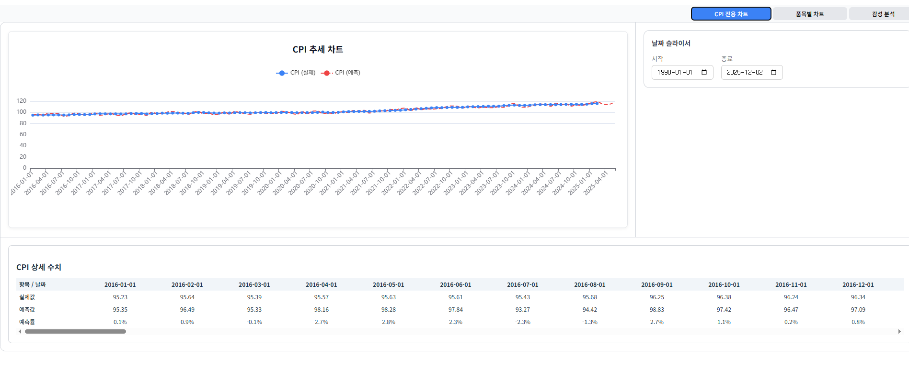
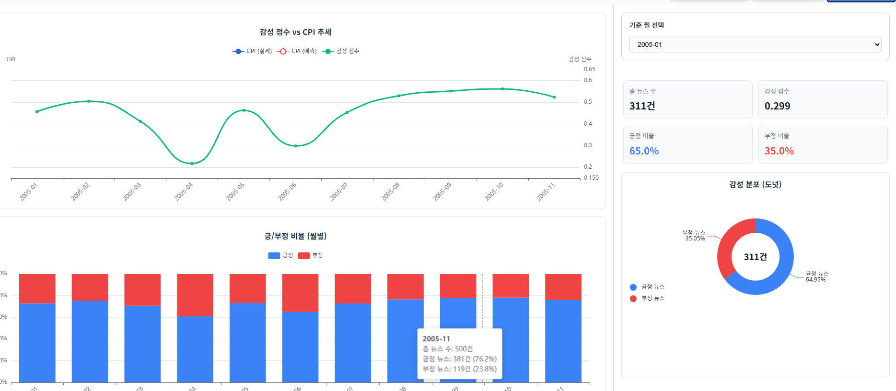
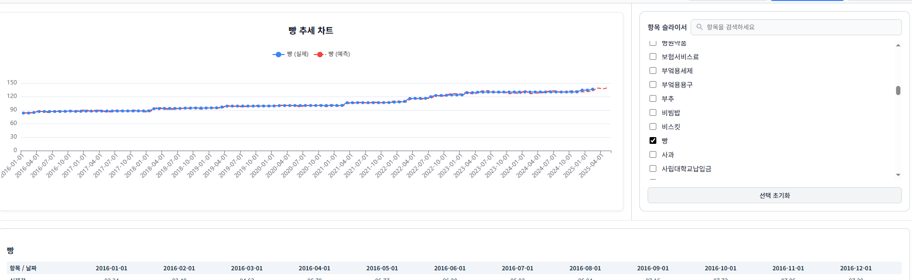

# CPI 예측 모델 (CPI Forecasting Model)

#프로젝트 개요

이 프로젝트는 **소비자물가지수(CPI)**를 예측하기 위한 머신러닝/딥러닝 모델 구현 예제입니다.

Lasso 회귀를 사용하여 CPI 예측에 중요한 변수를 선택

CNN-LSTM 기반 딥러닝 모델로 시계열 데이터를 학습

예측 결과를 시각화 및 CSV 저장 기능 제공

🛠 기술 스택
언어: Python 3.9+

데이터 분석: pandas, numpy

딥러닝: PyTorch, scikit-learn

시각화: matplotlib

#프로젝트 구조

/cpi_forecasting
├── data/ # 원본 데이터 및 모델 구현 결과 그래프
├── models/ # 학습된 모델 저장 및 검증 코드
├── sentiment_analysis # 감성분석 코드
├── ui/ # ui 코드
└── README.md

#설치 방법

git clone https://github.com/junn34/Project_with_CNN_LSTM-.git
cd Project_with_CNN_LSTM-

모델 실행 방법
\*\* csv 파일들을 임의로 변경하지 마시오

각 과정들을 번호 순서대로 실행하세요.

##데이터 전처리
1.lassoCV.py
2.newIndexing.py

##모델 훈련 및 검증
1.trainModel.py
2.validation.py(선택)

##실행

1.main.py

##시각화

### 1. CPI 추세 차트

### 2. 감성 점수 vs CPI 추세

### 3. 품목별 추세 차트

## License

This project is licensed under the MIT License - see the [LICENSE](LICENSE) file for details.
